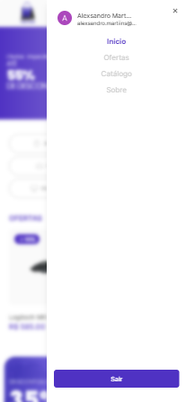
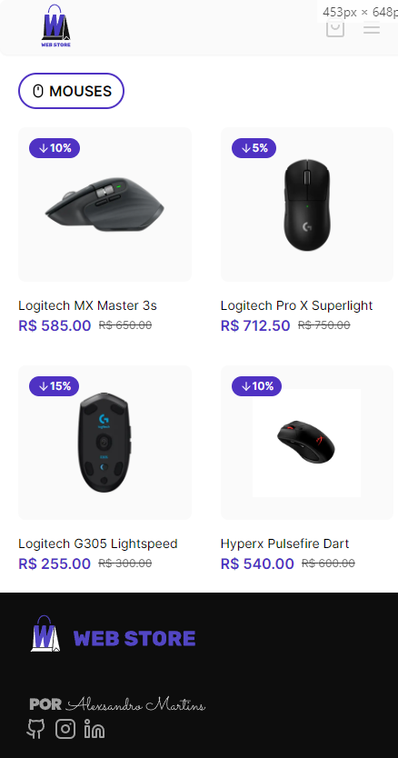
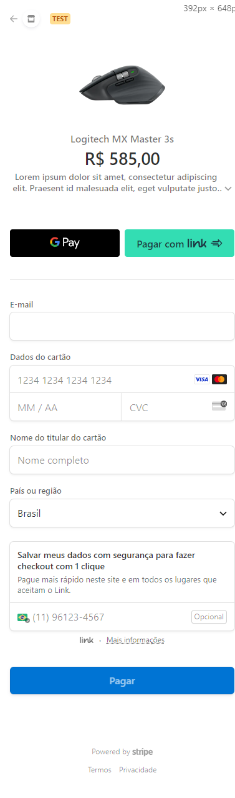

# Web Store

Web store é um e-commerce feito com [Prisma](https://www.prisma.io/), [NextJS](https://nextjs.org/), [Typescript](https://www.typescriptlang.org/) e [Stripe](https://stripe.com/br).

## Índice

- [Sobre o Projeto](#sobre-o-projeto)
- [Tecnologias Utilizadas](#tecnologias-utilizadas)
- [Como Iniciar](#como-iniciar)
- [Configuração](#configuração)
- [Iniciando Servidor](#iniciando-servidor)
- [Uso](#uso) WIP
- [Contato](#contato)

## Sobre o Projeto

O Website foi criado com o intuito de desenvolver um e-commerce totalmente funcional com next, prisma e typescript. Além das tecnológias citadas, foi usado Shadcn e o OAUTH do google para login.

### Capturas de Tela

<details>
<summary>Clique para expandir as capturas de tela versão mobile</summary>

### Tela Inicial


### Tela de Menu



### Página de Categoria



### Página de Detalhes do Produto


### Carrinho de Compras


### Pagamento Stripe



</details>

## Tecnologias Utilizadas

- [Next.js](https://nextjs.org/)
- [Prisma](https://prisma.io/)
- [TypeScript](https://www.typescriptlang.org/)
- [ShadCN](https://ui.shadcn.com/)
- [Tailwind](https://tailwindcss.com/)

## Como Iniciar

Siga as instruções abaixo para configurar e iniciar o seu projeto de e-commerce.

### Pré-requisitos

Certifique-se de ter as seguintes ferramentas instaladas em sua máquina:

- [Node.js](https://nodejs.org/)
- [npm](https://www.npmjs.com/) (ou [Yarn](https://yarnpkg.com/))
- [Git](https://git-scm.com/)
- Um banco de dados suportado pelo Prisma (por exemplo, PostgreSQL, MySQL)

### Instalação

1. Clone este repositório para o seu ambiente local:

   ```bash
   git clone https://github.com/Alexsandro-ms/web-store.git
   ```

2. Navegue até o diretório do projeto:

   ```bash
   cd seu-projeto
   ```

3. Instale as dependências do projeto:
   ```bash
   npm install
   # ou, se estiver usando o Yarn
   yarn
   ```

### Configuração

1. Copie o arquivo de exemplo .env.example para .env e configure as variáveis de ambiente necessárias, como as credenciais do banco de dados e as chaves de API:

   ```bash
   cp .env.example .env
   ```

Abra o arquivo .env em um editor de texto e adicione as informações apropriadas.

2. Execute as migrações do banco de dados com o Prisma:

   ```bash
   npx prisma migrate dev
   ```

## Iniciando Servidor

Iniciar o Servidor de Desenvolvimento
Agora que o projeto está configurado, você pode iniciar o servidor de desenvolvimento:

    ```bash
    npm run dev
    # ou, se estiver usando o Yarn
    yarn dev
    ```

Isso iniciará o servidor em http://localhost:3000/. Abra o seu navegador e acesse essa URL para ver o seu projeto em ação.
Lembre-se de consultar o seu README.md para informações mais detalhadas sobre o projeto, como funcionalidades específicas e dicas de uso.

## Contato

Caso queira entrar em contato comigo, segue minhas redes sociais:

- [Instagram](https://www.instagram.com/alexsandrom.s/)
- [LinkedIn](https://www.linkedin.com/in/alexsandromartiins/)
